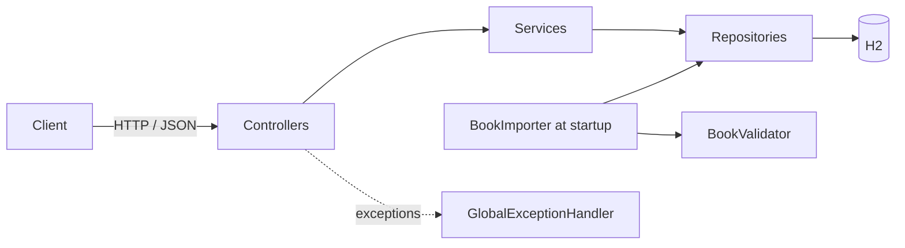
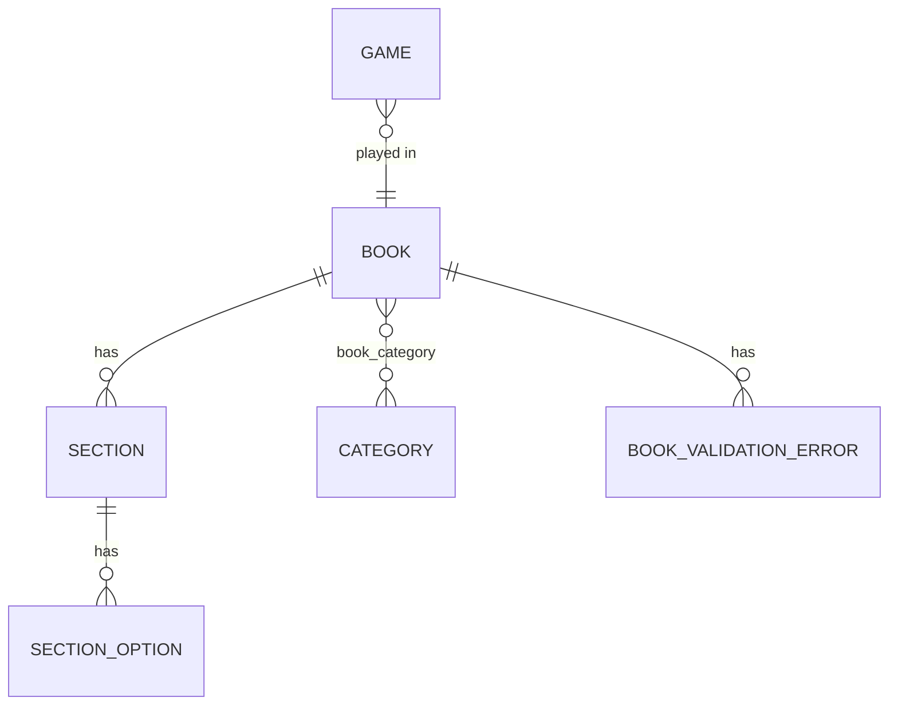

# Adventure Book API

REST API to browse a collection of adventure books and play through them:
choose an option at the end of each section, jump to the next one, and survive
the consequences.

Implemented: objectives 1–4 (listing and search, book details and categories,
reading and moving between sections, consequences and health).
Objectives 5 and 6 are described in [Not implemented](#not-implemented).

**Stack:** Java 21, Spring Boot 4.1, Spring Web MVC, Spring Data JPA (Hibernate),
H2, Maven, springdoc OpenAPI (Swagger UI), JUnit 5, AssertJ, MockMvc.

## Build and run

Requirements: Java 21. Maven is not required — the project includes the Maven Wrapper.

Run tests:

    ./mvnw test

Start the application:

    ./mvnw spring-boot:run

Or build and run the JAR:

    ./mvnw package
    java -jar target/adventure-book-0.0.1-SNAPSHOT.jar

On Windows use `mvnw.cmd` instead of `./mvnw`.

The application starts on port 8080.

## How to try

After startup:

- Swagger UI: http://localhost:8080/swagger-ui.html
- H2 console: http://localhost:8080/h2-console
  (JDBC URL `jdbc:h2:mem:adventurebook`, user `sa`, empty password)

### Sample data

Books from `src/main/resources/books/` are imported at startup.
All provided sample books break the spec's rules (see [Assumptions](#assumptions)),
so a corrected copy of *The Prisoner* is added for playing:

| Book | Valid | Why |
| --- | --- | --- |
| The Crystal Caverns | no | Section 666 is not an ending but has no options |
| Pirates of the Jade Sea | no | Section 1 points to non-existent section 999; section 666 has no options |
| The Prisoner | no | Section 666 is not an ending but has no options |
| The Prisoner (fixed) | **yes** | Copy of *The Prisoner* without section 666 |
| `dragon-quest.json` | — | Empty file, skipped with a warning |

### Play a game

1. Find the book id: `GET /books?title=fixed`
2. Start a game: `POST /books/{bookId}/games` → section 1, health 10
3. Make choices: `POST /games/{gameId}/choices` with body `{"option": 1}`

A winning path in *The Prisoner (fixed)*: options `1`, `0`, `0`
(look under the bed → cut yourself on a nail, health 4 → open the door).
To see the player die, keep choosing option `0`: trying the locked door costs
3 health each time.

Every game response contains the current section with its options,
`health`, `status` (`IN_PROGRESS`, `COMPLETED`, `DEAD`) and the text of the
consequence of the last move.

### Endpoints

| Method | Path | Description |
| --- | --- | --- |
| GET | `/books?title=&author=&category=&difficulty=` | List books; all filters are optional and can be combined |
| GET | `/books/{id}` | Book details, including validation errors |
| PUT | `/books/{id}/categories/{name}` | Attach an existing category to a book (idempotent) |
| DELETE | `/books/{id}/categories/{name}` | Detach a category from a book (idempotent) |
| GET | `/categories` | List categories |
| POST | `/categories` | Create a category, body `{"name": "fantasy"}` |
| POST | `/books/{bookId}/games` | Start a game in a valid book |
| GET | `/games/{gameId}` | Current state of a game |
| POST | `/games/{gameId}/choices` | Make a choice, body `{"option": 0}` |

## Architecture

Layered Spring Boot application:



| Package | Responsibility |
| --- | --- |
| `controller` | HTTP endpoints; thin, no business logic |
| `service` | Use cases and transactions |
| `model` | JPA entities; game rules live in `Game` |
| `repository` | Spring Data repositories and search specifications |
| `dto` | Request and response records; entities are never exposed |
| `importer` | Loading JSON books and default categories at startup |
| `validation` | The spec's book validity rules |
| `exception` | Domain exceptions and their mapping to HTTP responses |

Data model:



- A section's `number` comes from the JSON file and is unique within a book;
  options point to the next section by its number.
- A consequence (type, value, text) is stored as columns of `section_option`.
- `Game` stores the current section number, health, status and a version
  for optimistic locking.

### Database

H2 in-memory database, so the project runs without installing anything.
The schema is created by Hibernate at startup and books are re-imported from
JSON, so every start begins with a clean state.

In production I would use PostgreSQL or Aurora PostgreSQL with Flyway
migrations and `ddl-auto: validate`. All data access goes through JPA,
so the switch is mainly the driver, connection settings and migrations.

## Key design decisions

Full context, options and reasons: [docs/DECISIONS.md](docs/DECISIONS.md).

1. **Section identity:** generated technical id plus the section number from
   JSON, unique within a book.
2. **Game state on the server:** clients can't change health or jump to the ending.
3. **Choice by option position** (`{"option": 1}`), not by target section.
4. **Reading only through a game:** no endpoint returns arbitrary sections.
5. **Categories in a table:** the spec lists examples followed by "etc.", so new
   categories can be created without code changes; attaching accepts only
   existing ones, so a typo can't create a category.
6. **Invalid books are loaded with their errors:** they can be browsed and
   categorized, but not played.

## Error handling

All errors are returned as [ProblemDetail](https://www.rfc-editor.org/rfc/rfc9457)
(RFC 9457), for example:

```json
{
  "title": "Not Found",
  "status": 404,
  "detail": "Book with id 999 not found",
  "instance": "/books/999"
}
```

| Status | When |
| --- | --- |
| 400 | Invalid parameter (allowed enum values are listed), invalid body, non-existent option |
| 404 | Book, category or game not found |
| 409 | Starting an invalid book, duplicate category, move in a finished game, concurrent modification |
| 500 | Unexpected error; details are logged, not returned |

Services throw domain exceptions; one `@RestControllerAdvice` maps them to
HTTP statuses, so controllers stay thin and services don't depend on HTTP.

## Testing

    ./mvnw test

- **Unit tests** (no Spring, no database): book validator, game rules
  (moves, endings, health, death), JSON mapper.
- **API tests** (`@SpringBootTest` + MockMvc): search, details, categories,
  full games to victory and to death, error responses.

## Assumptions

Where the spec is silent:

- All provided sample books are invalid by the spec's rules. The rules are
  applied strictly; a corrected copy of *The Prisoner* is added for playing.
- Files that cannot be turned into a book are skipped with a warning:
  empty files, missing title/author/difficulty, sections without id/type/text,
  options without `gotoId`, duplicate section ids within a book.
- Books are identified by title and author; already imported books are skipped.
- Health has no upper limit; the spec defines only the start value (10) and death at 0.
- When a consequence brings health to 0 or below, the player dies in the section
  where the choice was made and does not move to the next section.
  Death takes precedence over reaching an ending.
- Category names are case-insensitive and stored in upper case.
- Deleting categories is not implemented (not required by the spec).

## Not implemented

**Objective 5 — players with their own progress.** The foundation is in place:
game state lives on the server and is saved after every move, and `Game` uses
optimistic locking. I would:

1. add a `Player` entity and make each game belong to a player;
2. start games for a player and list a player's saved games (`GET /players/{id}/games`);
3. add a `PAUSED` status with pause and resume actions; moves are already rejected
   unless the game is in progress;
4. store H2 in a file so progress survives restarts (the import already skips
   existing books and categories).

**Objective 6 — adding books.** `POST /books` would reuse the existing JSON
format, mapper and validator: invalid books are stored with their errors,
like at startup, and duplicates (same title and author) return 409.

## Known limitations / what I would improve

- `Book → Section` and `Section → SectionOption` are unidirectional `@OneToMany`
  relations. Hibernate inserts child rows and then issues extra `UPDATE`s
  for the foreign key and order column. Negligible for startup import of a few
  books; for large volumes I would make the relations bidirectional
  (`@ManyToOne` on the child, `mappedBy` on the parent).
- Book categories are loaded lazily per book, so listing books issues one
  extra query per book (N+1). For large volumes I would fetch categories together
  with books (`@EntityGraph` or `join fetch`).
- The book list is not paginated. With a large catalog I would use
  Spring Data `Pageable`.
- A repeated identical choice request (e.g. a client retry after a timeout) is
  processed as a new move. The client could send the section it moves from
  (`{"option": 0, "fromSection": 20}`), and the server would reject the move
  with 409 if the game is no longer there.
- There is no authentication, and game ids are sequential, so anyone who knows
  or guesses a game id can make moves in that game. In production, games would
  belong to an authenticated player, and ids would not be guessable (e.g. UUIDs).